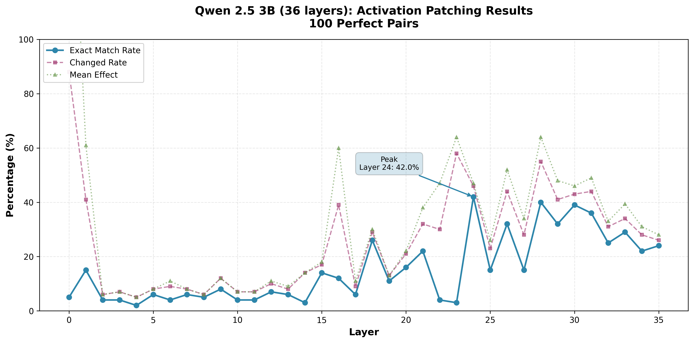

# LLM Counting Analysis

Mechanistic interpretability experiments investigating how language models internally represent and track counts during simple counting tasks.

## Experiments Performed

### 1. Model Benchmarking on Counting Task

**Objective**: Evaluate how accurately different foundation models can count matching items in short lists.

**Dataset**: 1000 examples from `counting_dataset.jsonl`
- Lists of 5-10 words randomly selected from 10 categories (fruit, animal, vehicle, color, tool, furniture, clothing, food, sport, instrument)
- 0-5 matching items per list (balanced distribution)
- Clear prompt format requesting answer in parentheses: `(N)`

**Models tested**: We initially benchmarked using AWS Bedrock for API access. To perform mechanistic interpretability experiments requiring model weights, we needed to run models locally. Memory constraints on EC2 led us to downsize to Qwen 2.5 3B, which could run comfortably on Google Colab's T4 GPU.

- **AWS Bedrock**: Llama 3.1 70B Instruct, Llama 3.1 8B Instruct, Claude 3.5 Haiku, Mistral 7B Instruct
- **Google Colab**: Qwen 2.5 3B Instruct

**Results**:


| Model | Accuracy | Parse Errors | Numerical Errors |
|-------|----------|--------------|------------------|
| Llama 3.1 70B | **78.2%** | 0.0% | 21.8% |
| Claude 3.5 Haiku | 57.8% | 0.0% | 42.2% |
| Mistral 7B | 49.6% | 0.3% | 50.1% |
| Qwen 2.5 3B | 35.2% | 0.0% | 64.8% |
| Llama 3.1 8B | 34.9% | 0.0% | 65.1% |

**Key findings**:
- All models successfully learned the output format (`(N)`) with minimal parse errors
- Accuracy scales strongly with model size (70B vs 8B shows 2.2x improvement)
- Qwen 2.5 3B performs comparably to Llama 3.1 8B despite being smaller
- Even on this simple task, smaller models struggle significantly
- Lenient parsing (accepting any number in parentheses or first number) was critical for fair evaluation (initial parsing error rates could in some cases exceed the rate of numerical errors)

---

### 2. Causal Mediation Analysis

To investigate which transformer layers causally mediate count information, we conducted activation patching experiments on Qwen models.

#### 2.1 Preliminary Investigation: Qwen 2.5 1.5B Instruct

**Objective**: Identify which transformer layers causally mediate count information by intervening on activations.

**Method**:
We generated pairs of lists identical except for the first word, which in one case was in the target category and in one case was not. This causes the correct count to differ by exactly 1 between the two lists.

**Example pair**:
```
Low count (2 tools):
Type: tool
List: cloud wrench door saw

High count (3 tools):
Type: tool
List: hammer wrench door saw

First word changed: 'cloud' → 'hammer'
Count changes from 2 to 3
```

**How Activation Patching Works**:

The key insight is that we patch **only one layer at a time**, not the entire forward pass:

```
Layers 0-20:  Process "cloud wrench door saw" (low-count prompt)
Layer 21:     PATCH! Replace activation with one from "hammer wrench door saw" (high-count prompt)
Layers 22-27: Continue forward pass with the patched activation
Generation:   Produce the answer
```

There are a number of reasons why this is different from just running the high-count prompt:
1. **Early layers (0-20)** still processed the original low-count tokens
2. **Residual connections** from earlier layers carry information forward that only processed the original low-count tokens
3. In **attention layers**, the **KV cache** retains keys and values from the low-count tokens
4. We're testing whether these mechanisms can be overridden by one layer's representation of "3 tools"

If patching layer 21 successfully changes the output from 2→3, this indicates that layer 21 **causally mediates** the count information—it's both necessary and sufficient to shift the model's answer.

For each minimal pair and each layer, we:
1. Extract the activation at the last token position from the high-count prompt
2. Patch this activation into the low-count prompt at the same layer and position
3. Measure the magnitude of change in the model's output

**Initial Results**:
- Layers 21-25 showed strongest effects (mean change ~0.44-0.45 in output)
- Early layers (0-10) showed minimal effects (<0.25)
- Mid-to-late layers exhibited a sharp transition, suggesting a computational phase change

**Methodological Note**: While this provided useful signal about which layers encode count-related information, this experiment was held back by the use of a model with subpar performance and an imperfect metric. We have since refined the analysis to include multiple metrics (change rate, directional accuracy, exact match) and moved to the larger Qwen 2.5 3B model.

#### 2.2 Main Experiment: Qwen 2.5 3B Instruct

Building on the preliminary findings, we conducted a larger-scale mediation analysis on Qwen 2.5 3B Instruct using 100 perfect pairs (pairs where the model achieved 100% accuracy with both greedy and temperature sampling).

**Results**:



| Layer Range | Mean Effect (%) | Changed Rate (%) | Exact Match Rate (%) |
|-------------|-----------------|------------------|----------------------|
| Early (0-14) | 5-14 | 5-14 | 2-8 |
| Mid (15-20) | 13-22 | 9-21 | 11-16 |
| **Late (21-27)** | **26-38** | **23-32** | **15-22** |
| **Peak: Layer 24** | **47** | **46** | **42** |

**Top Performing Layers by Exact Match Rate**:
- **Layer 24**: 42% exact match, 47% mean effect, 46% changed rate
- Layer 28: 40% exact match, 64% mean effect, 55% changed rate
- Layer 30: 39% exact match, 46% mean effect, 43% changed rate
- Layer 31: 36% exact match, 49% mean effect, 44% changed rate
- Layer 26: 32% exact match, 52% mean effect, 44% changed rate

**Key Findings**:
The 3B model shows **substantially stronger causal effects** than the 1.5B model. Layer 24 achieves a **42% exact match rate**, meaning that patching a single layer's activation successfully shifts the model's output to the target count in 42% of cases. This demonstrates genuine causal mediation of count information. The strongest effects concentrate in the later layers (24-31), suggesting these layers play a critical role in finalizing count representations.

---

### 3. Linear Probe Analysis

To supplement our understanding of the representation of the count, we trained linear probes on Qwen 2.5 1.5B Instruct.

**Objective**: Determine whether count information is linearly decodable from layer activations.

**Method**:
- Collected activations from all 28 layers on 5,000 examples
- Trained logistic regression classifiers to predict count (0-5) from each layer's activations
- Evaluated on held-out test set (4,000 train / 1,000 test split)

**Results**:

| Layer Range | Test Accuracy |
|-------------|---------------|
| Early (0-10) | 69.6% - 75.8% |
| Middle (11-17) | 75.5% - 84.5% |
| **Late (18-27)** | **85.9% - 93.9%** |

**Peak Performance Layers**:
- Layer 20: 90.8%
- Layer 21: 91.8%
- Layer 22: 91.2%
- Layer 23: 92.6%
- Layer 24: 92.6%
- Layer 25: 92.5%
- Layer 26: 93.5%
- Layer 27: 93.9%

**Key Findings**:
The progressive increase in probe accuracy through the network (69.6% → 93.9%) indicates hierarchical processing, with early layers encoding basic features and late layers consolidating count information in a linearly separable format. The concordance with causal mediation results suggests that layers 21-27 both contain linearly accessible count representations and causally mediate the model's counting behavior.

---

## Conclusion

This task is harder than it might initially seem. While counting items in short lists appears simple, language models typically solve such tasks using chain-of-thought reasoning tokens. Our results show a clear trend: larger models perform substantially better (Llama 3.1 70B: 78.2% vs Qwen 2.5 3B: 35.2%).

### Convergent Evidence for Late-Layer Count Representation

We investigated count representation using two complementary methods on Qwen 2.5 models:

**Activation Patching (Qwen 3B, 100 pairs)**: Patching single-layer activations achieved up to **42% exact match rate** at layer 24, with the strongest effects concentrated in layers 24-31. This demonstrates genuine causal mediation—a single layer's representation can successfully override the model's original computation in a substantial fraction of cases, even when competing against residual connections and attention from earlier layers that processed different inputs.

**Linear Probing (Qwen 1.5B, 5000 examples)**: Test accuracy improved progressively through the network, from 69.6% (layer 0) to 93.9% (layer 27), with layers 20-27 achieving 90.8-93.9% accuracy. This shows count information becomes increasingly explicit and linearly accessible in later layers.

### Understanding the Methods

These methods provide complementary insights:

- **Linear probes** passively read out information that correlates with the count, revealing what information is present in the representations
- **Activation patching** actively tests whether a representation can causally steer the model's behavior, revealing which layers mediate the computation

The 42% exact match rate from patching demonstrates that late-layer representations causally mediate counting behavior. Both methods independently identify late layers as critical for count processing, though they measure different aspects of the representation.

---

## Repository Structure

```
├── data/
│   └── counting_dataset.jsonl     # 5000 examples for all experiments
│
├── results/                        # All final outputs
│   ├── benchmark_results_bedrock.json    # Bedrock benchmarking results
│   ├── qwen_benchmark_results.json       # Qwen 3B benchmarking results
│   ├── benchmark_comparison.png          # Combined benchmark visualization
│   ├── mediation_results_qwen3b-final.json  # Qwen 3B mediation results (100 pairs)
│   ├── mediation_qwen3b.png              # Qwen 3B mediation visualization
│   ├── mediation_results_v2.json         # Qwen 1.5B mediation results
│   └── probe_results_v2.json             # Qwen 1.5B probe results
│
├── notebooks/
│   └── qwen_benchmark_colab.ipynb # Colab notebook (runs benchmarking + mediation)
│
└── scripts/
    ├── generate_dataset.py        # [AUXILIARY] Creates counting_dataset.jsonl
    ├── benchmark_bedrock.py       # [MAIN] Bedrock benchmarking
    ├── plot_benchmark.py          # [AUXILIARY] Creates benchmark_comparison.png
    ├── plot_mediation_qwen3b.py   # [AUXILIARY] Creates mediation_qwen3b.png
    ├── mediation_utils.py         # [AUXILIARY] Helper functions for mediation
    └── causal_mediation_v2.py     # [MAIN] Qwen 1.5B mediation and probing
```

### Scripts Used for Final Results

**Experiment 1: Model Benchmarking**
- `scripts/benchmark_bedrock.py` → `results/benchmark_results_bedrock.json`
- `notebooks/qwen_benchmark_colab.ipynb` (benchmark section) → `results/qwen_benchmark_results.json`
- `scripts/plot_benchmark.py` → `results/benchmark_comparison.png`

**Experiment 2: Causal Mediation Analysis**
- Qwen 1.5B: `scripts/causal_mediation_v2.py` on AWS EC2 → `results/mediation_results_v2.json`
- Qwen 3B: `notebooks/qwen_benchmark_colab.ipynb` (mediation section) → `results/mediation_results_qwen3b-final.json`
- `scripts/plot_mediation_qwen3b.py` → `results/mediation_qwen3b.png`

**Experiment 3: Linear Probe Analysis**
- Qwen 1.5B: `scripts/causal_mediation_v2.py` on AWS EC2 → `results/probe_results_v2.json`

**Auxiliary Scripts**
- `scripts/generate_dataset.py` - Dataset generation
- `scripts/mediation_utils.py` - Helper functions for mediation analysis

---

*Written with the help of Claude Sonnet 4.5*

## Citation

```bibtex
@misc{llm-counting-analysis,
  author = {Daniel Larsen},
  title = {LLM Counting Analysis: Mechanistic Interpretability of Simple Counting Tasks},
  year = {2025},
  url = {https://github.com/Larsen-Daniel/llm-counting-analysis}
}
```
