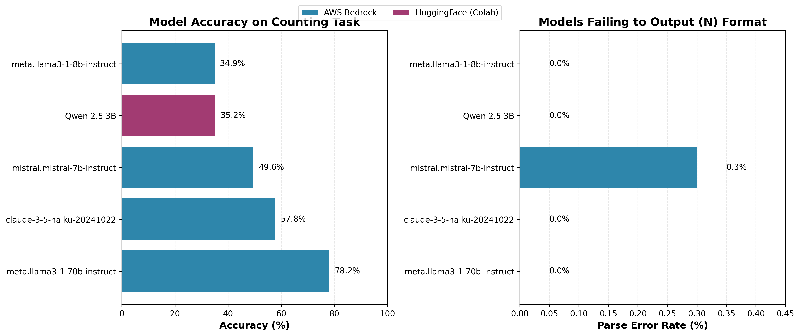

# LLM Counting Analysis

Mechanistic interpretability experiments investigating how language models internally represent and track counts during simple counting tasks.

## Experiments Performed

### 1. Model Benchmarking on Counting Task

**Objective**: Evaluate how accurately different foundation models can count matching items in short lists.

**Dataset**: 1000 examples from `counting_dataset.jsonl`
- Lists of 5-10 words randomly selected from 10 categories (fruit, animal, vehicle, color, tool, furniture, clothing, food, sport, instrument)
- 0-5 matching items per list (balanced distribution)
- Clear prompt format requesting answer in parentheses: `(N)`

**Models tested**: We initially benchmarked using AWS Bedrock for API access. To perform mechanistic interpretability experiments requiring model weights, we needed to run models locally. Memory constraints on EC2 led us to downsize to Qwen 2.5 3B, which could run comfortably on Google Colab's T4 GPU.

- **AWS Bedrock**: Llama 3.1 70B Instruct, Llama 3.1 8B Instruct, Claude 3.5 Haiku, Mistral 7B Instruct
- **Google Colab**: Qwen 2.5 3B Instruct

**Results**:



| Model | Accuracy | Parse Errors | Numerical Errors |
|-------|----------|--------------|------------------|
| Llama 3.1 70B | **78.2%** | 0.0% | 21.8% |
| Claude 3.5 Haiku | 57.8% | 0.0% | 42.2% |
| Mistral 7B | 49.6% | 0.3% | 50.1% |
| Qwen 2.5 3B | 35.2% | 0.0% | 64.8% |
| Llama 3.1 8B | 34.9% | 0.0% | 65.1% |

**Key findings**:
- All models successfully learned the output format (`(N)`) with minimal parse errors
- Accuracy scales strongly with model size (70B vs 8B shows 2.2x improvement)
- Qwen 2.5 3B performs comparably to Llama 3.1 8B despite being smaller
- Even on this simple task, smaller models struggle significantly
- Lenient parsing (accepting any number in parentheses or first number) was critical for fair evaluation

---

### 2. Mechanistic Analysis on Qwen 2.5 1.5B Instruct

To investigate the internal representation of counting, we conducted two complementary experiments on Qwen 2.5 1.5B Instruct: causal mediation analysis and linear probing.

#### 2.1 Causal Mediation Analysis via Activation Patching

**Objective**: Identify which transformer layers causally mediate count information by intervening on activations.

**Method**:
We generated 200 minimal pairs—prompts identical except for the first word, which determines whether it matches the target category. This causes the correct count to differ by exactly 1 between paired prompts.

**Example minimal pair**:
```
Low count (4 tools):
Type: tool
List: tuba tennis ruler clamp motorcycle indigo tape document hammer

High count (5 tools):
Type: tool
List: saw tennis ruler clamp motorcycle indigo tape document hammer

First word changed: 'tuba' → 'saw'
Count changes from 4 to 5
```

For each minimal pair and each layer, we:
1. Extracted the activation at the last token position from the high-count prompt
2. Patched this activation into the low-count prompt at the same layer and position
3. Measured the magnitude of change in the model's output

**Initial Results**:
- Layers 21-25 showed strongest effects (mean change ~0.44-0.45 in output)
- Early layers (0-10) showed minimal effects (<0.25)
- Mid-to-late layers exhibited a sharp transition, suggesting a computational phase change

**Methodological Note**: The initial implementation measured output magnitude changes rather than exact match rates. While this provided useful signal about which layers encode count-related information, we have since refined the analysis to include multiple metrics (change rate, directional accuracy, exact match) and null hypothesis testing via random sampling baselines.

#### 2.2 Linear Probe Analysis

**Objective**: Determine whether count information is linearly decodable from layer activations.

**Method**:
- Collected activations from all 28 layers on 5,000 examples
- Trained logistic regression classifiers to predict count (0-5) from each layer's activations
- Evaluated on held-out test set (4,000 train / 1,000 test split)

**Results**:

| Layer Range | Test Accuracy |
|-------------|---------------|
| Early (0-10) | 69.6% - 75.8% |
| Middle (11-17) | 75.5% - 84.5% |
| **Late (18-27)** | **85.9% - 93.9%** |

**Peak Performance Layers**:
- Layer 20: 90.8%
- Layer 21: 91.8%
- Layer 22: 91.2%
- Layer 23: 92.6%
- Layer 24: 92.6%
- Layer 25: 92.5%
- Layer 26: 93.5%
- Layer 27: 93.9%

**Key Findings**:
Both causal mediation and linear probing converge on **layers 21-25** as the critical region for count representation. The concordance between causal importance (mediation) and linear decodability (probing) suggests that:
1. Count information is explicitly represented in these layers
2. This representation is both causally relevant to model outputs and linearly accessible
3. The representation becomes progressively refined in later layers

The progressive increase in probe accuracy through the network indicates hierarchical processing, with early layers encoding basic features and late layers consolidating count information in a linearly separable format.

---

## Repository Structure

```
├── data/
│   └── counting_dataset.jsonl     # 5000 examples for all experiments
│
├── results/                        # All final outputs
│   ├── benchmark_results_bedrock.json    # Bedrock benchmarking results
│   ├── qwen_benchmark_results.json       # Qwen 3B benchmarking results
│   ├── benchmark_comparison.png          # Combined benchmark visualization
│   ├── mediation_results_v2.json         # Causal mediation results
│   └── mediation_results_v2.png          # Mediation visualization
│
├── notebooks/
│   └── qwen_benchmark_colab.ipynb # Colab notebook (runs benchmarking + mediation)
│
└── scripts/
    ├── generate_dataset.py        # [AUXILIARY] Creates counting_dataset.jsonl
    ├── benchmark_bedrock.py       # [MAIN] Bedrock benchmarking
    ├── plot_benchmark.py          # [AUXILIARY] Creates benchmark_comparison.png
    ├── mediation_utils.py         # [AUXILIARY] Helper functions for mediation
    └── causal_mediation_v2.py     # [NOT USED - see notebook instead]
```

### Scripts Used for Final Results

**Experiment 1: Model Benchmarking**
- `scripts/benchmark_bedrock.py` → `results/benchmark_results_bedrock.json`
- `notebooks/qwen_benchmark_colab.ipynb` (benchmark section) → `results/qwen_benchmark_results.json`
- `scripts/plot_benchmark.py` → `results/benchmark_comparison.png`

**Experiment 2: Mechanistic Analysis (Qwen 2.5 1.5B)**
- Causal mediation analysis executed via standalone Python script on AWS EC2
- Linear probe training executed via standalone Python script on AWS EC2
- Results: `results/mediation_results_v2.json`, `results/probe_results_v2.json`

**Auxiliary Scripts**
- `scripts/generate_dataset.py` - Dataset generation
- `scripts/mediation_utils.py` - Helper functions for mediation analysis
- `scripts/causal_mediation_v2.py` - [DEPRECATED] Early mediation script (replaced by notebook implementation)

---

*Written with the help of Claude Sonnet 4.5*

## Citation

```bibtex
@misc{llm-counting-analysis,
  author = {Daniel Larsen},
  title = {LLM Counting Analysis: Mechanistic Interpretability of Simple Counting Tasks},
  year = {2025},
  url = {https://github.com/Larsen-Daniel/llm-counting-analysis}
}
```
